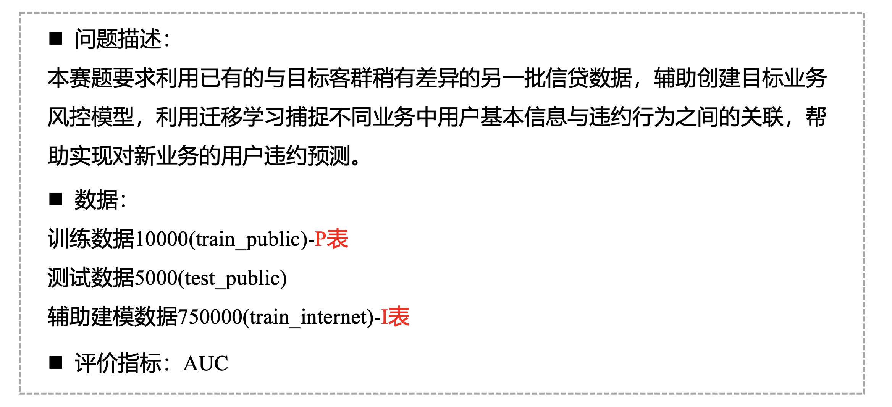
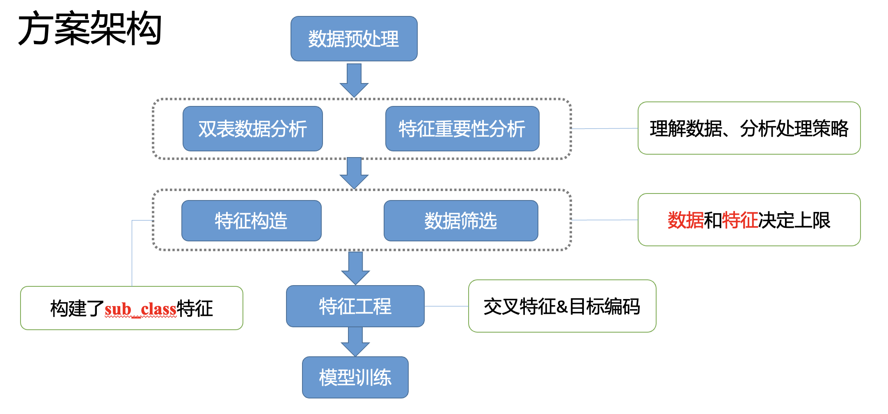
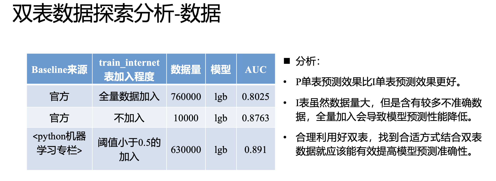
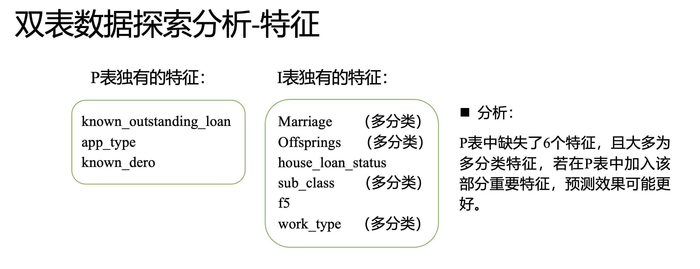
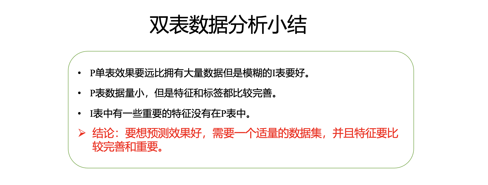
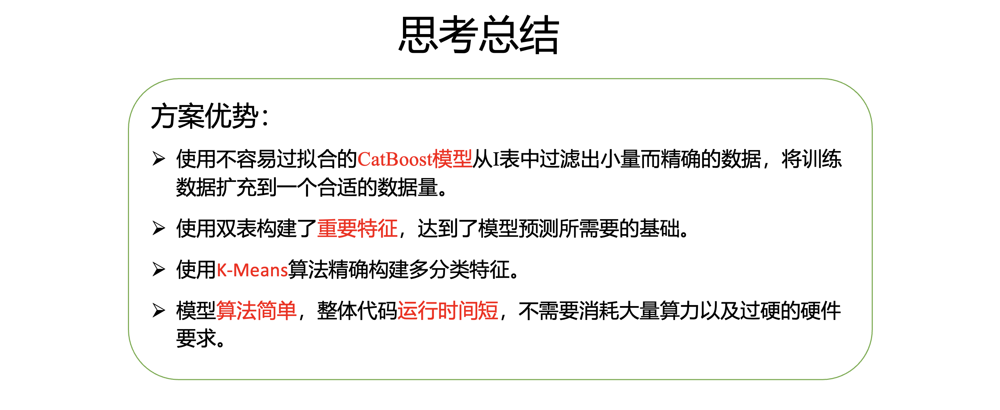

## 个贷违约预测（冠军方案 - B榜 0.9121)

---

##### 队名：雅俗共赏，队长：翟亚雷， 邮箱：2542174006@qq.com.

### 1. 赛题分析



### 2.  解题思路&方案



#### **思路概述：**

**为了充分利用好双表数据，进行了数据填充，查看train_internet里的关键特征，以及个贷相关资料显示，网贷等级重要性比较高，而train_public数据集中缺失了sub_class，所以首先对该特征进行了构建。**

**75w的全量数据全部加入训练效果不是很好，但是发现小量准确的数据效果却很好，于是想到用train_public做训练集，train_internet做测试集，过滤出少量而精确的数据。**

**将构建好的特征以及过滤后的数据一并加入训练数据集，使用xgboost进行预测。**







- 3.1 预处理

  - 3.1.1 对f1~f5和recircle_u特征用均值填充，对特征pub_dero_bankrup用前一个值进行了填充
  - 3.1.2  对特征work_year、class、work_type、mployer_type、industry进行基本预处理
  - 3.1.3 从issue_date和earlies_credit_mon中提取时间相关特征
  - 3.1.4 对total_loan、debt_loan_ratio、house_exist进行异常截断
- 3.2 构造特征policy_code和sub_class

  - 3.2.1 对*_public数据集使用聚类预测特征policy_code
  - 3.2.2 通过class的A~G特征分为7类，对此7类分别进行聚类预测，每一类聚为5类，预测特征sub_class
- 3.3 特征工程

  - 3.3.1 依据特征house_exist、debt_loan_ratio、 industry、title进行**目标编码**
  - 3.3.2 **交叉特征**

    - ```python
      # 具体如下
      groupby(['industry'])[f1~f4].transform('mean')
      groupby(['post_code'])['interest'].transform('mean')
      groupby(['industry'])['interest'].transform('mean')
      groupby(['employer_type'])['interest'].transform('mean')
      groupby(['recircle_u'])['recircle_b'].transform('std')
      early_return_amount / early_return

      ['house_exist','debt_loan_ratio','industry','title']
      ```
- 3.4 过滤数据

  - ###### 取出train_public和train_internet中的公共特征列，以train_public为训练集，train_internet为测试集，采用**catboost**模型进行训练，将阈值小于0.07的数据加入训练集中。
- 3.5 模型训练和预测

  - 使用**xgboost**对数据进行训练以及预测, 线上B榜得分0.91216699344

  

  线下得分0.96115

  



### 3.  代码结构及功能介绍

##### data文件下有4个文件夹，其中：

```
|- code---代码文件夹
  |- feature1.py---预处理及生成新特征。数据预处理后通过train_public 和 test_public 预测生成特征 post_code和sub_class
  |- feature2.py---数据预处理及特征工程。新特征加入到原始数据中，对完整数据集分别进行预处理和特征工程。
  |- model_filter.py---过滤数据。过滤train_internet中的数据，将过滤后的精确数据和原始数据集合并，输出用于模型训练的完整数据集。
  |- model_prediction.py---训练模型。
  |- main.py---程序启动项。执行该文件可以启动预测程序并输出预测结果进行保存。
|- prediction_result---程序预测输出存放文件夹
|- user_data---建模、预测过程中需要生成的中间数据存放文件夹（未用到）
|- raw_data---源数据文件夹
```

### 4.  开发环境及版本

此赛题使用 pycharm 2021.1.3(Community Edition) 、python(3.8)环境运行。numpy(1.19.5)，pandas(1.2.4)，scikit-learn(0.24.1)，catboost(0.26.1)，xgboost(1.5.0)。硬件配置：CPU(Intel(R) Core(TM) i5-5200U @ 2.20GHz  2.19 GHz)，内存12GB，2核4线程。

**（本代码运行大约需要时间3min）**
